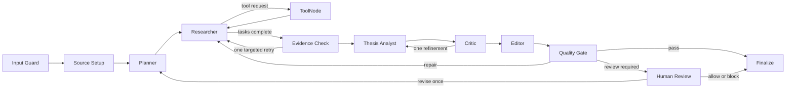

# Evidence-Grounded Equity Research Agent

This project is a local, read-only equity research system for analysts, students, and investors who want a structured company report without manually assembling filings, earnings-call commentary, financial statements, news, and analyst ratings. The system produces balanced bull and bear theses, explains the evidence behind each thesis, calculates financial trends, and sends only uncertain or risky cases to human review.

The application is designed for research and education. It does not place trades, modify financial accounts, or provide personalized investment advice.

## What the report contains

For a ticker and research question, the application can produce:

- an executive summary and company overview;
- recent company and market developments;
- a financial snapshot with quarterly and year-over-year charts;
- revenue growth, margins, cash flow, and other calculated metrics;
- management commentary grounded in earnings-call transcripts;
- grouped bull and bear theses with supporting evidence, counterarguments, monitoring indicators, and invalidation conditions;
- a risk register;
- report confidence, thesis evidence scores, and a safety-suspicion score with explanations;
- separate source coverage and linked-citation sections; and
- an execution profile showing time spent in each stage.

Each thesis is evidence-gated. A plausible statement is not enough: it must have a traceable source and sufficient support before it can appear in the final report.

## Architecture at a glance

The application is a 12-node LangGraph workflow with one real tool-execution node. Planning, thesis development, and critique use language models where judgment is useful. Period resolution, calculations, evidence checks, report assembly, safety routing, and finalization are deterministic.



The complete current-state design is documented in [design/architecture.md](design/architecture.md).

## Who writes and reads the vector database

The graph gives each component a narrow responsibility:

| Component | Vector database responsibility |
|---|---|
| Source Setup | Fetches eligible SEC filings and earnings-call transcripts on a cache miss, cleans and chunks the documents, creates embeddings, and writes them to Chroma. |
| Researcher | Does not query Chroma. It deterministically selects the first pending task from the approved research plan and requests the matching tool. |
| ToolNode | Executes one of five read-only research tools. `gather_text` retrieves filtered filing or transcript passages from Chroma. The other tools query financial statements, company profile data, news, and analyst ratings. |
| Evidence Check and later nodes | Read structured evidence already stored in LangGraph state; they do not search Chroma directly. |

Chroma is a source-document cache and retrieval index, not a cache of completed reports. Repeated runs can reuse eligible filing and transcript chunks, but current financial data, news, ratings, analysis, quality checks, and report generation still run again.

## The 12 nodes

| # | Node | Current responsibility |
|---:|---|---|
| 1 | Input Guard | Validates the ticker and question, detects advice-seeking language, and rejects prompt-injection patterns. |
| 2 | Source Setup | Resolves the reporting window and prepares cached or newly ingested filing and transcript sources. |
| 3 | Planner | Uses structured model output to propose evidence tasks, then deterministically adds any required coverage tasks. |
| 4 | Researcher | Deterministically dispatches the next approved task and tracks task completion. |
| 5 | ToolNode | Runs the requested read-only tool and returns normalized evidence to the graph. |
| 6 | Evidence Check | Verifies required evidence roles and permits one targeted research retry when coverage is unbalanced. |
| 7 | Thesis Analyst | Generates distinct bull and bear candidates from the approved evidence. |
| 8 | Critic | Scores support, rejects weak or duplicate theses, and allows one bounded refinement round. |
| 9 | Editor | Deterministically assembles the report, preserves citations, and calculates report confidence. |
| 10 | Quality Gate | Checks completeness, source faithfulness, unsupported claims, overconfidence, and safety signals. |
| 11 | Human Review | Pauses only exception cases so a reviewer can allow, revise, or block the report. |
| 12 | Finalize | Publishes the report or a clear withheld-report notice and records the audit event. |

## Research tools

The graph exposes five read-only LangChain tools through a single `ToolNode`:

| Tool | Primary source | Result |
|---|---|---|
| `gather_number` | Financial statements and market-data provider | Exact values and deterministic calculations such as growth and margins |
| `gather_text` | Chroma passages from SEC filings and earnings-call transcripts | Passage-supported management, risk, and strategy evidence |
| `gather_profile` | Company profile provider | Sector, industry, business summary, executives, and related profile fields |
| `gather_news` | News provider | Recent company developments with dates and source URLs |
| `gather_ratings` | Analyst-rating provider | Rating distribution and recent rating actions |

The tools return typed evidence records. Raw tool output is normalized before it reaches the analysis nodes.

## Deterministic work and language-model work

| Deterministic | Language model assisted |
|---|---|
| Ticker and input validation | Structured research-plan proposal |
| Reporting-window resolution | Passage-level claim extraction from retrieved text |
| Task dispatch and retry limits | Bull and bear thesis generation |
| Financial calculations | Independent thesis critique and refinement |
| Required-evidence checks | Borderline critique panel when configured |
| Evidence-role enforcement | |
| Duplicate and support gates | |
| Report assembly and citation preservation | |
| Confidence calculation and safety routing | |
| Final publication or withholding | |

This separation keeps facts, calculations, routing, and citations reproducible while using language models for synthesis and judgment.

## RAG and memory

The system uses four different state or memory surfaces:

| Surface | Purpose | Lifetime |
|---|---|---|
| LangGraph `GraphState` | Current request, plan, evidence, theses, report, safety flags, and routing state | One run |
| LangGraph checkpointer | Resumable execution and human-review interrupts | Run/thread lifetime |
| Chroma vector database | Cleaned filing and transcript chunks plus metadata and embeddings | Persistent local cache |
| JSON long-term memory | Prior numeric snapshots and management-tone summaries | Persistent local memory |

A Chroma record includes the chunk text and metadata such as company, period, report date, source, URL, document type, section, and chunk number. Retrieval filters by company, period, document type, and transcript period before applying semantic ranking and diversity selection.

The default embedding model is `BAAI/bge-small-en-v1.5`. The embedding backend can use Hugging Face or a deterministic hashing fallback, depending on configuration.

## Evidence, confidence, and safety scores

- **Thesis evidence score** is the Critic's 0-to-1 assessment of one thesis across four equally weighted checks: evidence support, internal consistency, materiality, and resilience if conditions change. A deterministic gate first requires every claim to have a citation or computed value. The default pass threshold is `0.60`.
- **Report confidence** summarizes the relative strength of the surviving bull and bear evidence. It is an internal evidence-quality indicator, not a probability that the stock will rise or fall.
- **Suspicion score** is a 0-to-100 safety-warning score. High-severity findings add 50 points and medium-severity findings add 25 points. For example, `suspicion = 25` normally means one medium-severity signal was found; it does not mean 25% fraud risk or 25% model confidence.

The operational escalation threshold is `50`, but explicit review triggers can require human review regardless of the total. These include advice seeking, prompt injection, severe source conflict, claims that remain ungrounded after repair, overconfident language, confidence below `0.35`, incomplete transcript coverage, missing required evidence, and report sections that remain incomplete after repair.

## Human review

Human review is exception-based, not required for every report. A run pauses when the quality gate finds a hard safety trigger, material source conflict, required evidence that remains missing after the allowed repair, or another configured escalation condition.

The reviewer sees the draft report, confidence, suspicion score, reason for escalation, and evidence flags. The reviewer can:

- **Allow** the report and send it to finalization;
- **Revise** the research request, which returns the run to planning for one bounded revision; or
- **Block** publication, which produces a clear withheld-report notice.

The local review queue is in memory. A production deployment should replace it with durable storage and authenticated reviewer access.

## Installation

From the `capstone` directory:

```bash
python -m venv .venv
source .venv/bin/activate
pip install -e ".[real,ui,dev]"
cp .env.example .env
```

Set at least:

```text
ANTHROPIC_API_KEY=...
EDGAR_USER_AGENT=Your Name your.email@example.com
```

LangSmith observability is optional:

```text
LANGSMITH_TRACING=true
LANGSMITH_API_KEY=...
LANGSMITH_PROJECT=equity-research-agent
```

The default reasoning model is `claude-opus-4-8`; the default routing model is `claude-haiku-4-5`. Both can be changed with environment variables documented in `.env.example`.

## Run the application

### Command line

```bash
equity-research NVDA --question "Can you research NVDA?"
```

Specify a reporting period:

```bash
equity-research NVDA -q "Analyze margins and management guidance" --as-of FY2025
```

Useful controls:

```bash
equity-research NVDA -q "Can you research NVDA?" --refresh-sources
equity-research NVDA -q "Can you research NVDA?" --no-hitl
```

`--refresh-sources` bypasses eligible cached filing and transcript chunks. `--no-hitl` is intended for controlled testing; it removes the reviewer interaction, not the quality checks.

### Streamlit interface

```bash
streamlit run src/equity_research/ui/app.py
```

The UI uses one balanced analysis path by default. It includes source-refresh control, structured report sections, financial charts, linked citations, quality explanations, review controls, and a runtime profile.

## Evaluation and testing

Run the automated test suite:

```bash
pytest
```

The current repository collects **315 tests across 22 test files**. The suite covers input safety, period resolution, source metadata, retrieval, calculations, planning, tool routing, evidence checks, thesis support, report formatting, citation links, quality routing, human review, runtime profiling, and provider behavior.

Run the guardrail ablation:

```bash
python -m evals.experiments.ablation
```

The bundled synthetic evaluation contains three seeded hazards: hallucination, overconfidence, and advice seeking. With no guardrails, none are caught. Each individual guardrail stage catches its corresponding hazard, and the combined configuration catches all three.

Run the score calibration experiment:

```bash
python -m evals.experiments.calibrate
```

On the bundled four-example labeled set, the experimental sweep selects a threshold of `25` with AUC `1.0`, false-positive rate `0.0`, and true-positive rate `1.0`; confidence expected calibration error is `0.3625`. These samples are intentionally small and are regression fixtures, not production performance estimates. The runtime therefore retains a conservative configurable threshold of `50` while more representative labeled data is collected.

## Observability

Each run records node transitions, sanitized action arguments, status, timing, and runtime profile. When LangSmith is enabled, the application adds explicit tracing around the graph run so operators can inspect node latency, tool activity, errors, and the end-to-end trace. The application still runs when LangSmith is disabled or unavailable.

## Project structure

```text
capstone/
├── README.md
├── design/
│   └── architecture.md
├── evals/
│   ├── datasets.py
│   ├── experiments/
│   ├── langsmith_adapter.py
│   └── metrics.py
├── src/equity_research/
│   ├── agents/
│   ├── guardrails/
│   ├── memory/
│   ├── observability/
│   ├── rag/
│   ├── tools/
│   ├── tot/
│   ├── ui/app.py
│   ├── config.py
│   ├── graph.py
│   ├── nodes_real.py
│   ├── run.py
│   └── schemas.py
└── tests/
```

## Current limitations

- The tool does not execute trades or provide personalized investment advice.
- Final reports are regenerated; only eligible source documents and limited long-term snapshots are reused.
- News and analyst-rating quality depend on upstream providers.
- Filing and transcript availability varies by company and reporting period.
- The local human-review queue is not a durable production workflow.
- The included evaluation datasets are small and should be expanded before making production-level quality claims.
- A production deployment still requires stronger authentication, secrets management, durable storage, monitoring, rate limiting, and licensed data-provider review.
