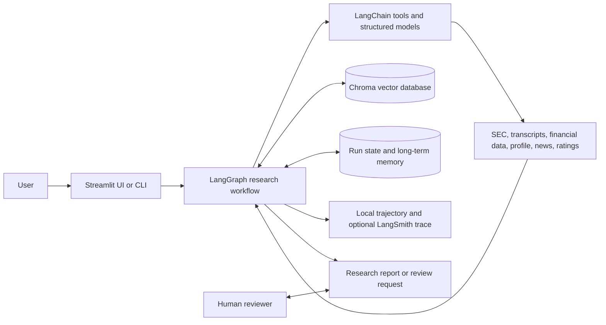
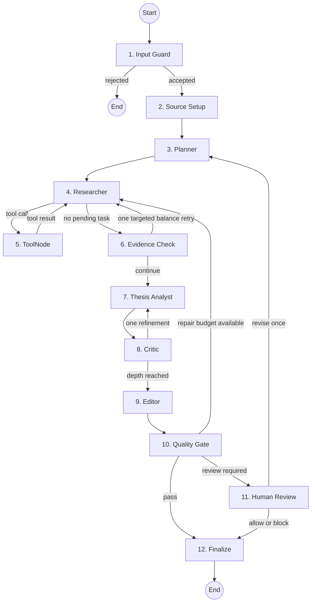
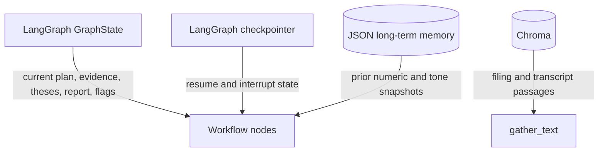
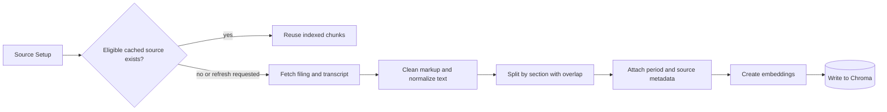
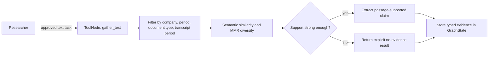
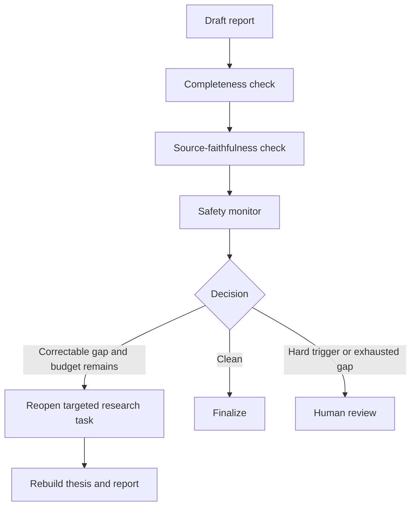
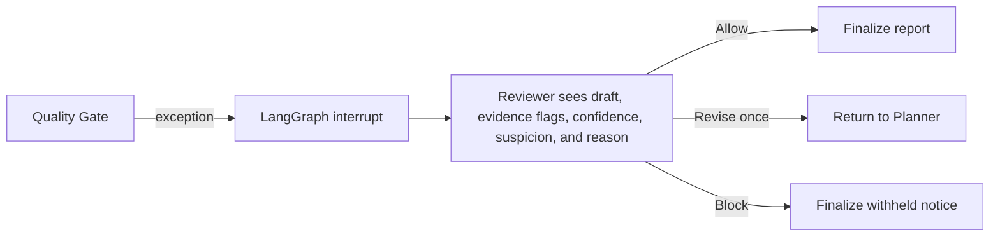

# Equity Research Agent — Current Architecture

**Status:** Current implementation  
**Last verified:** 2026-09-08  
**Application package:** `src/equity_research`

This document describes the system that is implemented in the repository today. The executable source, tests, and configuration remain the final source of truth.

## 1. Purpose and scope

The system turns a ticker and a natural-language research question into a structured, evidence-grounded equity research report. It is intended for analysts, students, and investors who want a repeatable way to combine public filings, earnings-call commentary, financial statements, company information, news, and analyst ratings.

The design has four primary goals:

1. build both bull and bear cases from traceable evidence;
2. separate model judgment from deterministic facts, calculations, and controls;
3. make the result explainable through citations, scores, and an execution trail; and
4. route uncertain or unsafe cases to a reviewer instead of silently publishing them.

The system is read-only. It does not place trades, connect to brokerage accounts, or provide personalized investment advice.

## 2. System context and technology



### 2.1 Technology responsibilities

| Technology | Responsibility in this project |
|---|---|
| LangGraph | Owns the 12-node workflow, conditional routing, cycles, checkpointing, and human-review interrupt. |
| LangChain | Provides messages, structured model output, tool definitions, the `ToolNode`, embeddings, and vector-store integration. |
| Chroma | Persists embedded SEC filing and earnings-call transcript chunks for filtered semantic retrieval. |
| Anthropic models | Provide structured planning, passage-level text extraction, thesis generation, and critique. |
| Streamlit | Presents input controls, progress, charts, the report, sources, and human-review actions. |
| LangSmith | Optionally records the end-to-end run and nested model/tool activity for debugging and latency analysis. |
| MCP adapter | Exposes the read-only research tool surface for external integration. The local UI and CLI use the in-process LangChain tools directly. |

LangGraph is the control plane. The vector database is a document-retrieval component, not the workflow engine or shared state transport.

## 3. Input and reporting-window contract

The request contains:

- `ticker`: normalized public-equity ticker symbol;
- `question`: the research request;
- `as_of`: optional reporting-period expression;
- `use_source_cache`: whether eligible filing and transcript chunks may be reused; and
- `hitl`: whether interactive human review is available.

The deterministic window resolver turns the period expression into a `ResolvedWindow` used by every downstream component.

| User request | Resolved evidence window |
|---|---|
| No period supplied | Latest available quarter plus the three preceding quarters |
| Named quarter | That quarter only |
| Fiscal year, annual, year-over-year, or trailing-twelve-month request | Four-quarter window |

The same period contract applies to planning, source metadata, retrieval filters, calculations, labels, citations, and report charts. This prevents one node from treating a request as a single quarter while another silently uses a multi-quarter window.

## 4. Node responsibilities

The compiled graph has exactly 12 nodes.

| # | Node | Type | Responsibility | Main output |
|---:|---|---|---|---|
| 1 | `input_guard` | Deterministic | Validates the ticker and question, detects advice language, and rejects prompt-injection patterns. | Validated request or safe rejection |
| 2 | `source_setup` | Deterministic orchestration | Resolves the window; reuses eligible cached sources or fetches, cleans, chunks, embeds, and stores filings and transcripts. | Resolved window and source inventory |
| 3 | `planner` | LLM plus deterministic coverage rules | Produces structured evidence tasks, then adds any required tasks that the model omitted. | Approved research plan |
| 4 | `researcher` | Deterministic | Selects the first pending approved task, maps it to a tool, and updates task status. | Tool request or completion signal |
| 5 | `tools` | Mixed | Executes one of five read-only tools and returns typed evidence. Text extraction uses a model; numeric calculations and normalization are deterministic. | Normalized evidence records |
| 6 | `evidence_check` | Deterministic | Tests required evidence roles and allows one targeted balance retry. | Coverage decision and any reopened task |
| 7 | `thesis_analyst` | LLM | Generates distinct bull and bear candidates using only approved evidence. | Thesis candidates |
| 8 | `critic` | LLM plus deterministic gates | Scores support, removes weak or duplicate candidates, ranks both sides, and allows one refinement round. | Supported bull and bear theses |
| 9 | `editor` | Deterministic in the current graph | Assembles the report, groups content, copies citations, calculates confidence, and constructs source links. | Draft report |
| 10 | `quality_gate` | Deterministic plus embedding similarity | Checks completeness, claim support, citation integrity, conflicts, overconfidence, advice risk, and retry budgets. | Pass, repair, or human-review decision |
| 11 | `human_review` | Human decision | Pauses exception cases and accepts allow, revise, or block. | Review decision |
| 12 | `finalize` | Deterministic | Publishes the report or a withheld-report notice and records the final audit event. | Final result |

### 4.1 Important boundary: the Researcher is not the RAG retriever

The `researcher` node does not search the vector database and does not independently invent new work. It is a deterministic dispatcher:

1. read the approved plan;
2. select the first pending task;
3. map the task kind to an allowed tool;
4. emit one tool call; and
5. mark the task complete when the tool result returns.

This makes the plan auditable and prevents uncontrolled tool loops.

## 5. Graph topology and routing



The graph contains bounded cycles, not open-ended autonomy:

- the tool loop ends when all approved tasks are complete;
- the evidence-balance loop has one retry by default;
- the thesis loop has a root pass and one refinement by default;
- the quality gate has one repair retry by default; and
- human review can request one revision by default.

All budgets are configurable and are recorded in state.

## 6. Data, RAG, and memory

### 6.1 Four storage surfaces



| Surface | Contains | Does not contain |
|---|---|---|
| `GraphState` | Request, resolved window, plan, messages, evidence ledger, theses, draft, quality result, review state, budgets, audit trajectory | Cross-run document corpus |
| Checkpointer | Serialized graph state needed to resume a thread or wait for human input | General semantic retrieval index |
| Chroma | Filing and transcript chunks, metadata, embeddings | Completed reports, current news, ratings, full graph state |
| JSON long-term memory | Prior numeric snapshots and management-tone summaries | Raw filing or transcript corpus |

### 6.2 Vector record example

A stored document is conceptually represented as:

| Field | Example | Purpose |
|---|---|---|
| `text` | `Data Center revenue increased...` | Searchable passage content |
| `company` | `NVDA` | Company filter |
| `period` | `FY2025-Q4` | Reporting-window filter |
| `report_date` | `2025-02-26` | Freshness and traceability |
| `source` | `NVIDIA earnings call` | Human-readable source label |
| `url` | `https://...` | Citation destination |
| `document_type` | `transcript` | Filing/transcript filter |
| `section` | `Management Discussion` | Section-aware retrieval |
| `chunk` | `12` | Stable chunk ordering |
| `section_part` | `2` | Oversized-section subdivision |
| `transcript_period` | `FY2025-Q4` | Transcript-specific period filter |

The vector database also stores the embedding generated for `text`.

### 6.3 Write path



The CLI and UI enable source-cache reuse by default. `--refresh-sources` bypasses eligible cached filing and transcript content.

### 6.4 Read path

Only `gather_text` reads Chroma during the normal application flow:



Retrieval is filter-first, then semantic. Maximal marginal relevance reduces redundant chunks. Weak retrieval is refused rather than converted into a confident claim.

### 6.5 What caching saves

Source caching can avoid repeated network download, parsing, chunking, and embedding for eligible filings and transcripts. It does not skip:

- plan generation;
- current financial, profile, news, or rating provider calls;
- evidence checking;
- thesis generation and critique;
- report assembly; or
- the quality gate.

There is no exact completed-report cache in the current implementation. Adding one would require a cache key that includes ticker, normalized question, resolved period, source versions, provider timestamps, model and prompt versions, and policy version.

## 7. Research tools and evidence model

### 7.1 Single tool-execution node

The graph registers one `ToolNode` containing five read-only tools:

| Tool | Reads | Processing | Writes to Chroma? |
|---|---|---|---|
| `gather_number` | Financial statements and market-data provider | Exact arithmetic and deterministic financial calculations | No |
| `gather_text` | Filtered Chroma passages | Model extracts claims that must be supported by the retrieved passage | No |
| `gather_profile` | Company profile provider | Normalizes business and executive information | No |
| `gather_news` | News provider | Normalizes dated developments and URLs | No |
| `gather_ratings` | Analyst-rating provider | Normalizes rating distribution and recent actions | No |

Only Source Setup writes filing and transcript content to Chroma. Every research tool returns its evidence to `GraphState` through the tool-result path.

### 7.2 Approved research plan

The planner returns typed tasks. The plan is the approved list of evidence-gathering actions, not a separate user-facing action table and not a list that the tools invent themselves.

Typical task kinds include:

- revenue growth and margin calculations;
- management-upside and management-downside commentary;
- filing-risk evidence;
- company profile;
- recent news; and
- analyst ratings.

After model planning, deterministic coverage rules add any missing broad-report tasks. Stable task identifiers let the Researcher and Evidence Check refer to the same task throughout retries.

### 7.3 Evidence ledger

Every normalized evidence record carries enough information for later nodes to verify it:

- evidence identifier;
- claim or metric;
- value and unit when numeric;
- company and period;
- source label and URL;
- source type;
- retrieval or calculation metadata;
- evidence role, such as upside, downside, risk, or context; and
- confidence/support fields where applicable.

The editor does not invent replacement citations. It copies source metadata from evidence that survived the support gates.

## 8. Thesis generation and report assembly

### 8.1 Balanced evidence before thesis writing

The evidence checker verifies that the ledger contains the required roles for the request. For a broad company report, those roles include positive and negative management commentary, filing risks, company context, recent developments, ratings, revenue growth, and key margin metrics.

If one side is missing, the checker may reopen one targeted task. After the retry budget is exhausted, it records the gap so the quality gate can decide whether the report may proceed or needs review.

### 8.2 Bull and bear generation

The Thesis Analyst receives only normalized, approved evidence. It creates bull and bear candidates with:

- a complete thesis statement;
- linked evidence identifiers;
- a counterargument;
- indicators the user should monitor; and
- conditions that would weaken or invalidate the thesis.

The Critic evaluates each candidate using four equally weighted dimensions:

1. evidence support;
2. internal consistency;
3. materiality; and
4. resilience if conditions change.

The deterministic support gate removes unsupported candidates, the Critic removes or merges overlapping candidates, and the ranker keeps up to two differentiated theses per side by default. The graph allows one refinement round.

Both sides are attempted for every accepted research run. If evidence is too weak for one side, the system does not fabricate a thesis; it records the evidence gap and may route the report to repair or review.

### 8.3 Deterministic report assembly

The Editor builds the current report without a free-form report-writing model call. It groups evidence and theses into:

- executive summary;
- company overview;
- recent developments;
- financial snapshot and trend series;
- management commentary;
- bull case;
- bear case;
- risk register;
- source coverage;
- confidence and safety explanations; and
- linked citations and appendix data.

The UI groups related theses and risks by topic, such as growth, margins, demand, operations, or valuation, so rich content does not appear as one long bullet list.

## 9. Quality, suspicion, and human review

### 9.1 Three different scores

| Score | Range | Meaning | Not a measure of |
|---|---:|---|---|
| Thesis evidence score | 0–1 | Strength of support for one thesis across citations, source quality, agreement, recency, and counter-evidence | Expected stock return |
| Report confidence | 0–1 | Relative strength and balance of the surviving thesis evidence | Probability that a forecast is correct |
| Suspicion score | 0–100 | Accumulated safety-warning severity | Fraud probability or investment risk percentage |

The default thesis pass threshold is `0.60`.

Suspicion weights are deterministic:

- high-severity signals add `50`: uncited claim, stale period, or prompt-injection marker;
- medium-severity signals add `25`: narrow support gap, source conflict, or provider divergence.

Therefore, `suspicion = 25` generally means one medium-severity warning. It does not mean the system is 25% suspicious.

### 9.2 Quality-gate routing



The operational escalation threshold defaults to `50`. Explicit review triggers can require human review independently of the total. The current triggers include advice seeking, prompt injection, severe source conflict, claims that remain ungrounded after repair, overconfident language, confidence below `0.35`, incomplete transcript coverage, missing required evidence, and report sections that remain incomplete after repair.

### 9.3 Human-in-the-loop flow



Human review is exception-based. It is not required for every report.

The local `ReviewQueue` keeps an in-memory audit record. A production deployment should use durable queue storage, authenticated reviewers, role-based permissions, timestamps, and an immutable decision audit.

## 10. Interfaces

### 10.1 Command line

The `equity-research` entry point accepts ticker, question, optional reporting period, source-refresh control, and optional non-interactive review behavior.

Example:

```bash
equity-research NVDA -q "Analyze growth, margins, management guidance, and risks" --as-of FY2025
```

### 10.2 Streamlit UI

The interface provides:

- ticker, question, and reporting-period inputs;
- one balanced analysis mode;
- a source-refresh option;
- progress and runtime information;
- financial snapshot cards and quarterly charts;
- grouped bull, bear, and risk sections;
- explanations for evidence, confidence, and suspicion scores;
- linked source citations; and
- allow, revise, and block controls when review is required.

Both interfaces call the same graph-building and execution path in `run.py`.

## 11. Observability and evaluation

### 11.1 Local observability

Every graph run records a safe trajectory containing:

- node name;
- sanitized action and argument summary;
- status;
- routing result;
- warnings or errors; and
- elapsed time.

The runtime profile aggregates time by stage so slow source, provider, model, or report steps can be identified. Sensitive tool payloads and secrets are not placed in the trajectory.

### 11.2 LangSmith

When `LANGSMITH_TRACING=true` and credentials are configured, `run_analysis()` creates an explicit tracing context around graph execution. LangSmith can then show the parent run, nested node/model/tool activity, latency, errors, and safe run metadata. Tracing is optional and fails open: the research application still runs if LangSmith is disabled or unavailable.

The repository also contains a LangSmith evaluation adapter for converting local examples and attaching project metrics.

### 11.3 Automated tests

The current repository collects 315 tests across 22 test files. Coverage includes:

- input and output guardrails;
- window resolution and period propagation;
- source metadata and ingestion;
- vector retrieval and weak-retrieval refusal;
- financial calculations and formatting;
- plan coverage and task routing;
- ToolNode behavior and evidence normalization;
- balance retries;
- thesis support and deduplication;
- citations and report structure;
- quality-gate repair and escalation;
- human-review decisions;
- runtime profiling; and
- provider retry, cache, and circuit-breaker behavior.

### 11.4 Guardrail ablation

The bundled ablation dataset has three seeded hazards. Miss rate is shown below; lower is better.

| Configuration | Hallucination miss | Overconfidence miss | Advice miss | Hazards caught |
|---|---:|---:|---:|---:|
| No guardrails | 0.25 | 0.25 | 0.25 | 0 |
| Pre only | 0.25 | 0.25 | 0.00 | 1 |
| During only | 0.25 | 0.00 | 0.25 | 1 |
| Post only | 0.00 | 0.25 | 0.25 | 1 |
| All | 0.00 | 0.00 | 0.00 | 3 |

The result shows that each stage covers a different failure mode and that the combined configuration catches all seeded hazards in this fixture.

### 11.5 Calibration experiment

On the bundled four-example labeled set, the threshold sweep reports:

| Metric | Result |
|---|---:|
| Experimental selected threshold | 25.0 |
| AUC | 1.0 |
| False-positive rate | 0.0 |
| True-positive rate | 1.0 |
| Confidence expected calibration error | 0.3625, `n=4` |

These are small regression fixtures, not production performance estimates. The operational runtime threshold remains a configurable `50` while more representative labeled cases are collected.

## 12. Core data models

The main typed models include:

- `ResearchRequest` and `ResolvedWindow`;
- `ResearchTask` and plan state;
- numeric and textual `EvidenceItem` records;
- `Thesis` candidates and support scores;
- `EquityResearchReport` and citation records;
- `QualityGateResult` and monitor findings;
- review requests and decisions; and
- runtime and trajectory observations.

Pydantic validation is used at system boundaries so malformed model or provider output fails clearly instead of drifting through the graph.

## 13. Configuration and deployment

Important defaults include:

| Setting | Default |
|---|---|
| Reasoning model | `claude-opus-4-8` |
| Routing model | `claude-haiku-4-5` |
| Embedding model | `BAAI/bge-small-en-v1.5` |
| Chroma persistence directory | `.chroma` |
| Long-term memory directory | `.memory` |
| Root thesis candidates | 4 |
| Theses retained per side | 2 |
| Thesis depth | 2, root plus one refinement |
| Critic pass threshold | 0.60 |
| Evidence-balance retries | 1 |
| Report/source repair retries | 1 each |
| Human revision budget | 1 |
| Operational suspicion threshold | 50 |

Configuration is centralized in `config.py` and environment variables. API keys belong in `.env` or the deployment secret manager and must never be committed.

Production hardening should add durable checkpoint and review storage, authentication, role-based access, centralized secrets, rate limiting, provider licensing review, and operational alerting.

## 14. Current limitations and planned direction

- Filing and transcript coverage depends on public-source availability and provider behavior.
- News and ratings depend on upstream data quality and freshness.
- Chroma caches eligible source documents but completed reports are regenerated.
- The in-memory human-review queue is suitable for local use, not multi-user production operation.
- The bundled evaluation sets are too small for claims about production accuracy, calibration, or reviewer workload.
- More labeled company/period cases are needed for citation precision, factual consistency, bull/bear balance, latency, and escalation-rate evaluation.
- A production deployment requires durable state, access control, audit retention, monitoring, rate limits, and licensed data-source review.

The intended future direction is to expand evaluation coverage, improve provider resilience and source freshness controls, make review infrastructure durable, and consider version-aware report-result caching only after its invalidation and audit requirements are defined.
